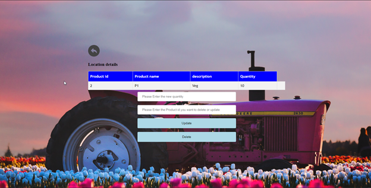

# Green Field Website

> Website for smooth transaction of produce made by farmers

---

### Table of Contents
You're sections headers will be used to reference location of destination.

- [Description](#description)
- [Abstract](#abstract)
- [OverView](#overview)
- [License](#license)

---

## Description

"The John Keells’ Supermarket chains along with the Department of Agriculture of Sri Lanka have decided to initiate a website for farmers all around Sri Lanka, to upload and notify about their harvest which then can be bought by the Keells staff. With the aim of providing the best produce to their customers straight from the farmers, this new approach benefits the farmers immensely as well for this is an easy approach in which they can reach out by which their produce can be sold. "

## Abstract

Farmers in Sri-Lanka always had a problem in selling their harvest to a supply chain with good commuincation. This is where Green field website shines. Now farmers can upload their harvest directly to the website along with the quantities and price and a supply chain can directly purchase from them. The supply chain can also rate the harvest from good to bad. All of the communication is maintained by the Department Of Agriculture of Sri-Lanka. DOA can approve farmers, rate their harvest and have a graph on best selling farmers. Theres also an in built chatting feature to help the supply chain and farmers communicate.

## OverView

- Login Page

- Farmer DashBoard

- Famer Harvest Upload

- Graph On Farmers & Products

- Produces Shown In Map Based On Farmer's Location

- Supply Chain DashBoard

- Supply Chain Reviewing Based On Farmer Location

- Chat System

#### Technologies

- Html/CSS
- JavaScript
- PhP
- Visual Studio Code

---

## References

- Instagram - [@krishan_shanuka](https://instagram.com/krishan_shanuka?utm_medium=copy_link)

## License

MIT License

Copyright (c) [2021] [Krishan Shanuka

Permission is hereby granted, free of charge, to any person obtaining a copy
of this software and associated documentation files (the "Software"), to deal
in the Software without restriction, including without limitation the rights
to use, copy, modify, merge, publish, distribute, sublicense, and/or sell
copies of the Software, and to permit persons to whom the Software is
furnished to do so, subject to the following conditions:

The above copyright notice and this permission notice shall be included in all
copies or substantial portions of the Software.

THE SOFTWARE IS PROVIDED "AS IS", WITHOUT WARRANTY OF ANY KIND, EXPRESS OR
IMPLIED, INCLUDING BUT NOT LIMITED TO THE WARRANTIES OF MERCHANTABILITY,
FITNESS FOR A PARTICULAR PURPOSE AND NONINFRINGEMENT. IN NO EVENT SHALL THE
AUTHORS OR COPYRIGHT HOLDERS BE LIABLE FOR ANY CLAIM, DAMAGES OR OTHER
LIABILITY, WHETHER IN AN ACTION OF CONTRACT, TORT OR OTHERWISE, ARISING FROM,
OUT OF OR IN CONNECTION WITH THE SOFTWARE OR THE USE OR OTHER DEALINGS IN THE
SOFTWARE.

